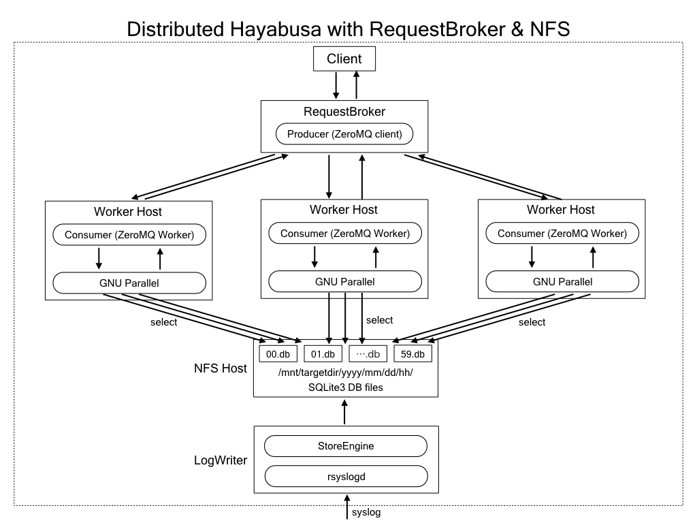

# Hayabusa2
Distributed Search Engine for Massive System Log Dataset

# Concept
- Distributed version of standalone Hayabusa(https://github.com/hirolovesbeer/hayabusa)
- Use Network Filesystem(NFS) for Large log storage
- Implement Request Broker for distributed workers
- Worker(nodes/processes) scale architecture
- WebUI

# Architecture
- WebUI
- RequestBroker
- Worker nodes
- NFS(Network File System)
- LogWriter
- Monitoring(Zabbix)

- Architecture Image


# WebUI Image

# Setup
## Recommended System Environment
- Amazon AWS(ECS) : m5.xlarge or higher
- Storage for NFS : 1TB or more(depend on the log volume)
- VPC for private network
- Internet connectivity for ansible setting
  - Anaconda install
  - apt, pip conda command exec

## Before instration
- ssh connection and login check for all hosts
- NFS disk mount for NFS host(mount /opt/nfs directory)

## Get Hayabusa2 sources and make the source code archive
1. Get the Hayabusa2 sources

```
$ git clone git@github.com:hirolovesbeer/hayabusa2.git
$ cd hayabusa2
```

2. Edit ansible hosts files

```
$ cd provision
$ cp hosts.sample hosts
$ vi hosts
```


## Provisioning with Ansible
### minimum machine configurations(Number of servers: 2)
1. WebUI/Client
2. RequestBroker + Worker + NFS + LogWriter


- ansible hosts file example
  - 192.168.0.10 : WebUI/client
  - 192.168.0.11 : RequestBroker/Worker/NFS/LogWriter

```
[basic]
[nfs]
# Use Public DNS or Public IP
192.168.0.11

[log-writer]
# Use Public DNS or Public IP
192.168.0.11

[request-broker]
# Use Public DNS or Public IP
192.168.0.11

[worker]
# Use Public DNS or Public IP
192.168.0.11

[webui]
# Use Public DNS or Public IP
192.168.0.10

[cli-client]
# Use Public DNS or Public IP
192.168.0.10

[monitor]
# Use Public DNS or Public IP <- comment out
# ec2-xxxx.ap-northeast-1.compute.amazonaws.com <- comment out
```

### worker scale-out configurations(Number of servers: 6-15)
1. WebUI/Client
2. RequestBroker
3. Worker hosts(1~10)
4. NFS server
5. LogWriter
6. Monitoring(Zabbix + LogAggregator)


- ansible hosts file example
  - 192.168.0.10 : WebUI/client
  - 192.168.0.11 : RequestBroker
  - 192.168.0.12 : NFS
  - 192.168.0.13 : LogWriter
  - 192.168.0.14 : Monitoring/LogAggregation
  - 192.168.0.15-24 : Worker hosts

```
[basic]
[nfs]
# Use Public DNS or Public IP
192.168.0.12

[log-writer]
# Use Public DNS or Public IP
192.168.0.13

[request-broker]
# Use Public DNS or Public IP
192.168.0.11

[worker]
# Use Public DNS or Public IP
192.168.0.15
192.168.0.16
192.168.0.17
192.168.0.18
192.168.0.19
192.168.0.20
192.168.0.21
192.168.0.22
192.168.0.23
192.168.0.24

[webui]
# Use Public DNS or Public IP
192.168.0.10

[cli-client]
# Use Public DNS or Public IP
192.168.0.10

[monitor]
# Use Public DNS or Public IP
192.168.0.14
```


## Exec install
- exec install command in provision directory

```
$ ansible-playbook -i hosts site.yml
```
