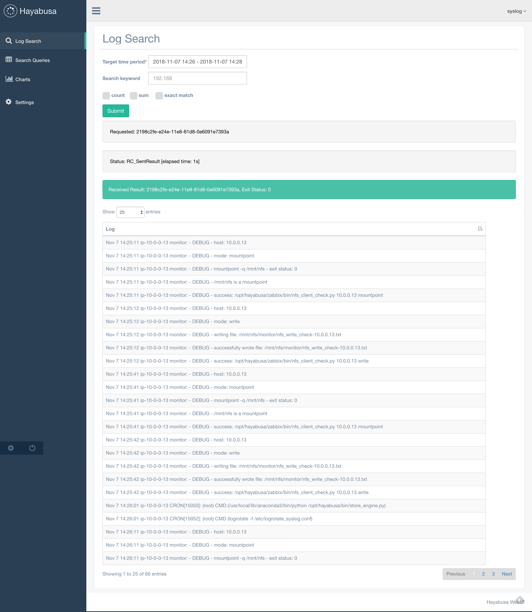

# Hayabusa2 Web UI
Base on the Flask Gentelella

[Gentelella](https://github.com/puikinsh/gentelella) is a free to use Bootstrap admin template.

# WebUI image

# Initial user & password
**This is initial user configuration. You should change the password as soon as possible!!**

|User|Password(for login)| user type |
|:---|:---:|---:|
|admin|VhLrUZziERQ5AjfKTXtF|administrator|
|syslog|tmpGCDreTJN4WszwMgbK|general user|
|auth|nhAfev3mXgCrN4EWBPbi|general user|
